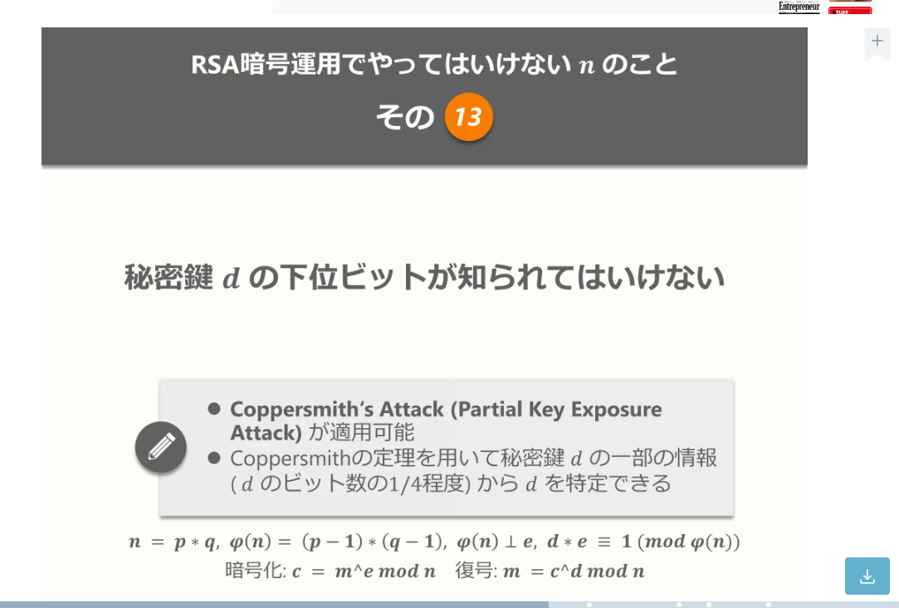

## omni RSA

```python
以下の暗号を解く

from Crypto.Util.number import *
from flag import flag

p, q, r = getPrime(512), getPrime(256), getPrime(256)
n = p * q * r
phi = (p - 1) * (q - 1) * (r - 1)
e = 2003
d = inverse(e, phi)

flag = bytes_to_long(flag.encode())
cipher = pow(flag, e, n)

s = d % ((q - 1)*(r - 1)) & (2**470 - 1)

assert q < r
print("rq =", r % q)

print("e =", e)
print("n =", n)
print("s =", s)
print("cipher =", cipher)

```

---

```python
以下の暗号を解く

from Crypto.Util.number import *
from flag import flag

p, q, r = getPrime(512), getPrime(256), getPrime(256)
n = p * q * r # 512 byteの素数を三つかけ合わせる
phi = (p - 1) * (q - 1) * (r - 1) # φ(n)を計算
e = 2003
d = inverse(e, phi) # ed = 1 mod φ(n)

flag = bytes_to_long(flag.encode())
cipher = pow(flag, e, n) # 暗号化 m = flag^e mod n

s = d % ((q - 1)*(r - 1)) & (2**470 - 1) # dがマスクされる 470bitよりも先が未知

assert q < r
print("rq =", r % q) # rをqで割ったあまり

print("e =", e)
print("n =", n)
print("s =", s)
print("cipher =", cipher)

```

---

ソースコードしか手に入らなかったため、あらかじめ Flag を決めて置き、その際のパラメーターから元の Flag を入手できればオーケーとします。  
パラメーターは以下のようになりました。

rq = 19810366367306768644232525389747537275045405439314176008633941392973721570576
e = 2003
n = 53664914438946444484927033862034379455718178099855523463910489141278737139791364848208743006407518112277320817669787439691746610553268296914262444216919462704386000709590354290776125186391163453068896662299911360086707554877293931251419654653697668300856682339771668434126765552712459921497413416092669041767

---

s = 1265360460709769693851512645319061903059544747651255568642678113569298391357942430157526652399779965777773923822682724660363135543391240091671
cipher = 3525641216292044326230126878010965135622104164889473380631987836858540038157143138676142725091457076602363325805674619659098806219641234241974545976708403653241036734687378559603323103895230661957412111732445158813275702605408361822949263056812334913257113499719211581915694082795450665196587909415670111499

---

## Solve

まず d がマスクされて渡されるため、自然数 k で剰余を開き、モニック多項式を立式したい(CopperSmith's Attack が使えるため)



---

## Coppersmith の定理

Coppersmith の定理は、整数 N を法とする方程式の求解に関する次のような定理である。

ある整数 N と次数 d のモニック多項式 f ∈ Z[x] に対し、f(x) = 0 (mod N) を満たすすべての |x| < N^(1/d-ε) (ε ≧ 0) は効率的に求めることができる。 w = min(1/ε, log2N) としたとき、計算時間はおおむね O(w) 次元の格子に対する LLL 格子次元縮小アルゴリズムの計算時間となる。

---

ここで、モニック多項式は最高次の係数が 1 となる多項式を指す。 普通の方程式の場合はニュートン法により解を求めることができるが、一般の N を法とする方程式はこのような方法で解を求めることができない。 この定理はそのような方程式についても、「N の d 乗根より小さな解」は現実的な時間で求められることを示している。

x^3 + 10*x^2 + 5000*x - 222 = 0 (mod 10001)
など

---

問題に戻ります。

ひとまず立式してみます。
まず、d を(q-1)(r-1)で割った余りを D と置きます。s は D の下位 470bit であるため、未知数 x を用いて次のように表せます。  
D = 2^470 \* x + s

D = d mod (q-1)(r-1)
を 未知数 k を用いて開くと
d = k(q-1)(r-1) + D

また、 ed = 1 mod φ(n)であるため、  
ek(q-1)(r-1) + e\*D = 1 mod φ(n)

---

未知数 l を用いて開くと、  
lφ(n) + 1 = ek(q-1)(r-1) + e\*D  
ここで mod (q-1)(r-1)を取ると
1 = eD mod (q-1)(r-1)

未知数 m を用いて剰余を開くと  
m(q-1)(r-1) + 1 = eD  
eD - 1 + m(q-1)(r-1) = 0  
ここで mod q を取ると  
e\*D - 1 - m(r-1) = 0 mod q  
e(2^470 \* x + s) - 1 - m(r-1) = 0 mod q

---

これでモニック多項式になったので、Coppersmith の定理を用いて解くことができる。
ちなみに、m は
m(q-1)(r-1) + 1 = eD
の式と D が(q-1)(r-1)未満であることを合わせると  
m が e と同じくらい、すなわち 2003 程度であることがわかる。  
よって m が 0 ~ 2003 で全探索すれば見つかる。

---

D が見つかった後、r か q が求まりそう。
上の式より、
m(q-1)(r-1) + 1 = eD

また、rq について考える。
rq = r mod q
が与えられる。
ここで r と q の bit 数は 256bit で r>q であることから
rq = r - q
q = r - rq

よって次の式を立式できる。
m(r-rq-1)(r-1) + 1 - eD = 0

---

m は全探索で求まり、rq e は与えられて、D は求めたので、r について解くことができる。

Coppersmith を求められる Sage Math を用いる。

https://sagecell.sagemath.org  
オンラインでできるため、ここで試します

---

```python
from Crypto.Util.number import *

mask = 2^470
for k in range(1, e):
    print(f"[*] {k} / {e}")
    F.<x> = PolynomialRing(Zmod(n))
    f = e*(x*shift + s) - 1 + k*rq - k
    f = f.monic() # モニック多項式に変換
    x0 = f.small_roots(X=2^42, beta=0.20, epsylon=1/16) # CopperSmith
    if len(x0) != 0:
        D = int(x0[0])*shift + s
        print("ok")
        break


var("r")
fr = 1 + k*(r - rq - 1)*(r - 1) - e*D
print(solve(fr, r))
```

---

結果

```
[*] 1925 / 2003
ok
[
r == -71364070454706574493074607301808248887021244918899871536682796743634973683421,
r == 91174436822013343137307132691555786162066650358214047545316738136608695253999
]
```

r > 0 なので r = 91174436822013343137307132691555786162066650358214047545316738136608695253999

---

これを用いて  
q = r - rq  
p = n // (q \* r)  
に代入すれば他の値を求められる。  
後は他の RSA 暗号と同様

以下 solve

---

```python
from Crypto.Util.number import *

r = 略
rq = 略
e = 2003
n = 略
s = 略
cipher = 略

q = r - rq
p = n // q // r
assert p*q*r == n

phi = (p - 1)*(q - 1)*(r - 1)
d = inverse(e, phi)
flag = pow(cipher, d, n)

print(long_to_bytes(flag))
```
