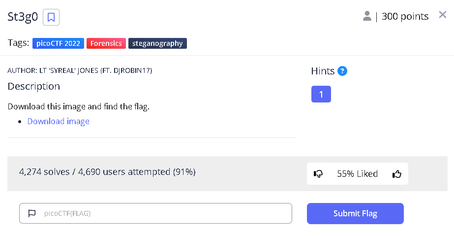

## St3g0

---

## 中身

---

## ステガノグラフィー

タイトル的にステガノグラフィーっぽそう

ステガノグラフィー（中: 隠写術，英: steganography）とは、情報隠蔽（英語版）技術の一つであり、情報を他の情報に埋め込む技術のこと、あるいはその研究を指す。暗号（cryptography）が平文の内容を読めなくする手段を提供するのに対して、ステガノグラフィーは存在自体を隠す点が異なる。(引用 wikipedis)

ステガノグラフィー解析は青空白猫でできる

---

## 解析

---

## チャンネルを変えていくと...

変えていっても何も隠されていなさそう...

---

## ビット抽出

試しに LSB のビットを抽出していく

---

## Flag 発見

RGB それぞれ抽出した際に Flag がでてきた

picoCTF{7h3r3_15_n0_5p00n_96ae0ac1}

---
