## WebNet0

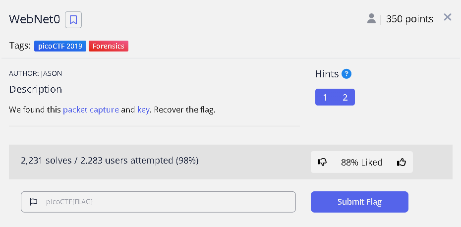

---

## ダウンロードしたファイル

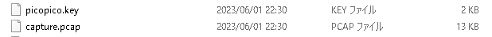

パケットキャプチャと鍵が入っている

---

## パケットの中身

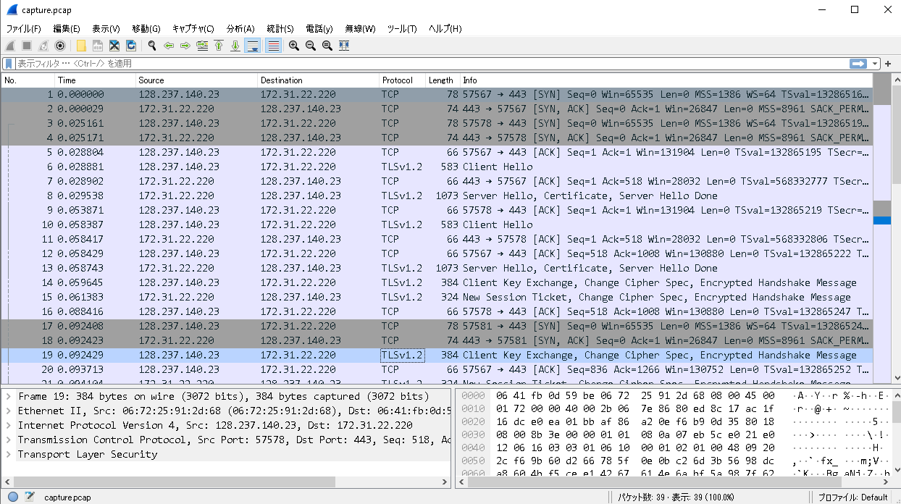

雰囲気的に TLS 通信 を鍵を使って復号する...?

---

## 鍵をインポート

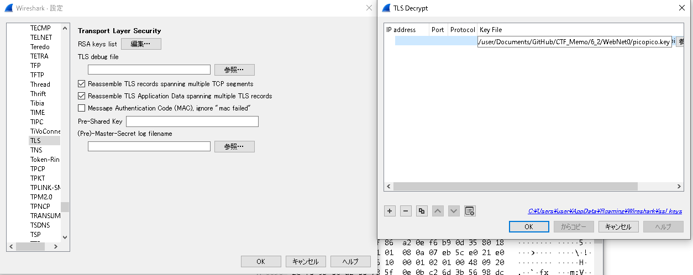

---

## 復号された通信を見ると...

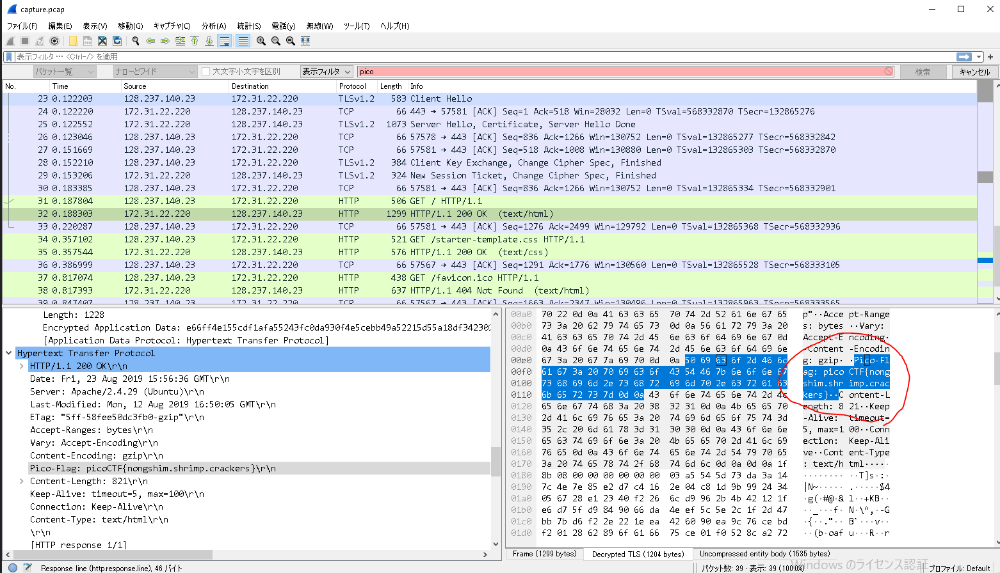

1 つ 1 つ通信を見ていくと、フラグを発見！！
picoCTF{nongshim.shrimp.crackers}

---

## WebNet1

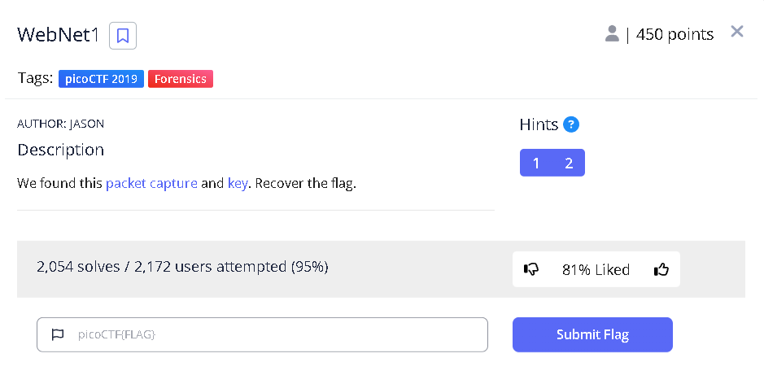

---

## ダウンロードしたファイル

WebNet0 と同様
鍵は同じだったので、WebNet0 と同じように復号する。

---

## 復号された通信を見ると...

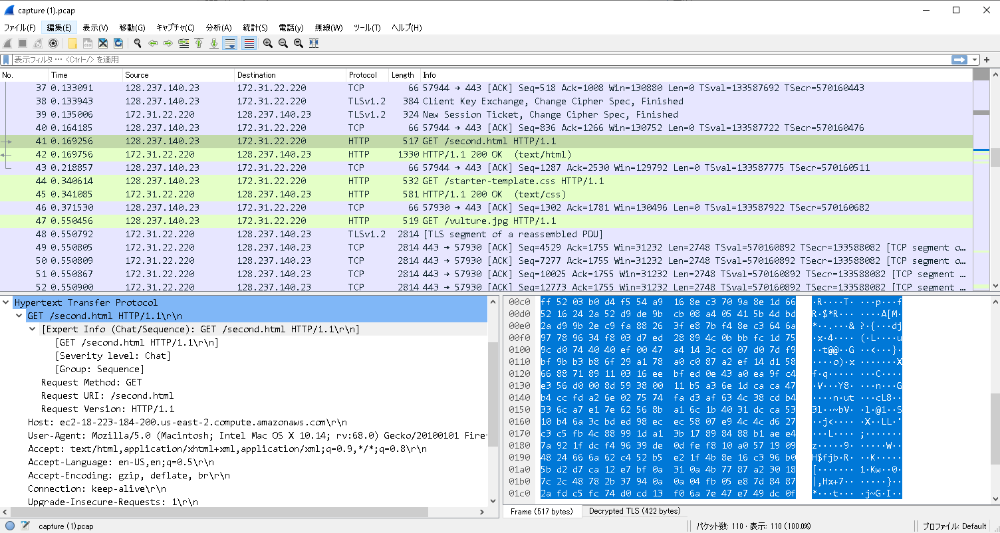

あまりよくわからないが、画像ファイルが怪しそう
vulture.jpg というファイルを書き出してみる

---

## 書き出された画像

---

## 青空白猫でみると

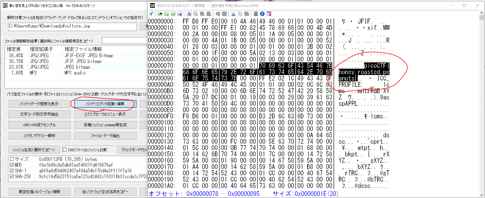

picoCTF{honey.roasted.peanuts}

---

## Torrent Analyze

---

## 日本語訳

説明
SOS、誰かが私たちのネットワーク上で torrent しています。
あなたの同僚の一人が、会社のネットワーク上で torrent を使用していくつかのファイルをダウンロードしています。ダウンロードされたファイルを特定することができますか？ファイル名は picoCTF{ファイル名}のようなフラグになります。捕捉されたトラフィック

---

## ダウンロードファイル

パケットキャプチャ、ただし容量が大きい
wireshark で開くと 58551 行

---

## 実際に wireshark で見てみると

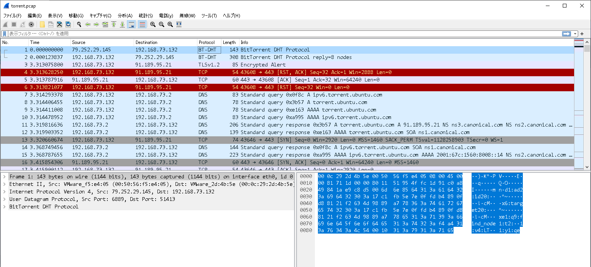

BitTorrent とあるので torrent ファイルをダウンロードしている？

---

調べていくと、torrent ファイルにはファイル名やサイズ等から算出された info-hash という情報を持っているらしい。

実際に info-hash で調べると何個かヒット

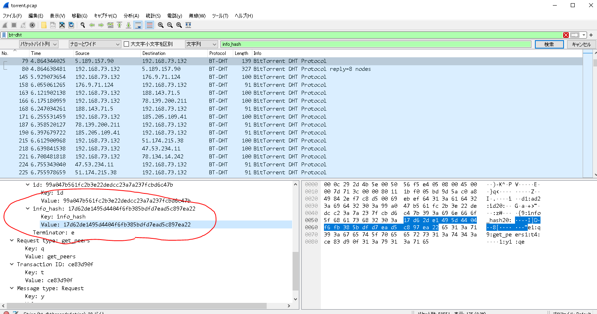

---

## ヒットした info_hash

- 17d62de1495d4404f6fb385bdfd7ead5c897ea22
- 17c1e42e811a83f12c697c21bed9c72b5cb3000d
- d59b1ce3bf41f1d282c1923544629062948afadd
- 078e18df4efe53eb39d3425e91d1e9f4777d85ac
- 7af6be54c2ed4dcb8d17bf599516b97bb66c0bfd
- 17c0c2c3b7825ba4fbe2f8c8055e000421def12c
- e2467cbf021192c241367b892230dc1e05c0580e

これらは sha なので直接検索すれば何かヒットする...かも？

---

## それっぽいリンクを発見

e2467cbf021192c241367b892230dc1e05c0580e で検索すると

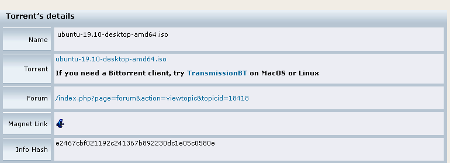

https://linuxtracker.org/index.php?page=torrent-details&id=e2467cbf021192c241367b892230dc1e05c0580e

---

Name :
ubuntu-19.10-desktop-amd64.iso

より

picoCTF{ubuntu-19.10-desktop-amd64.iso }
