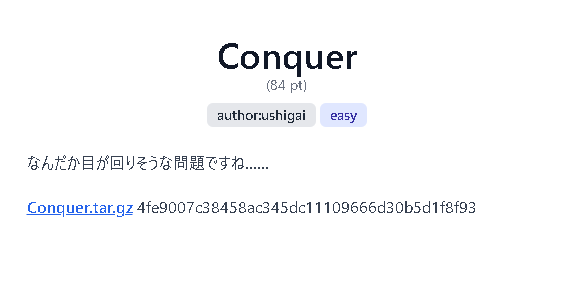
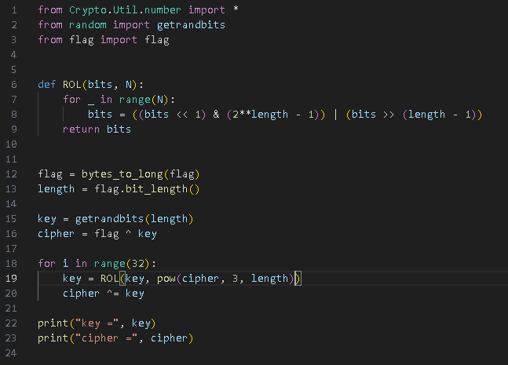
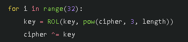
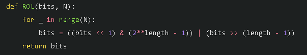
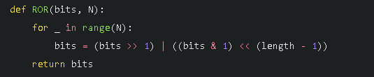
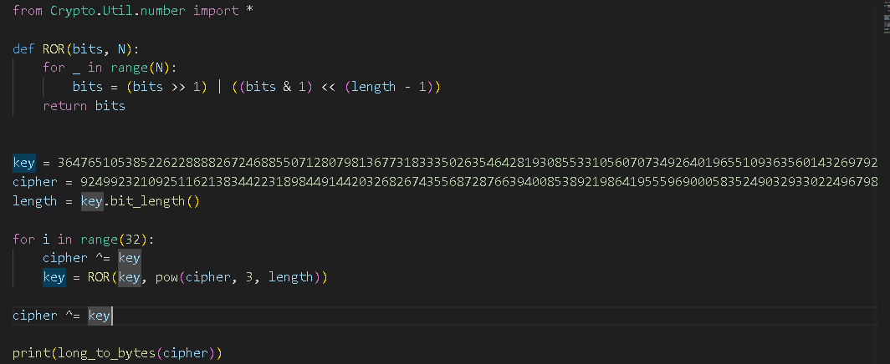
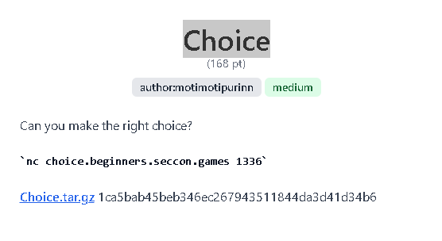
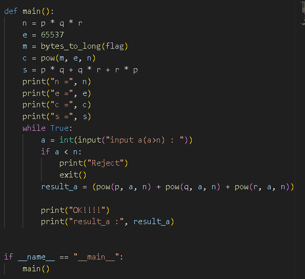
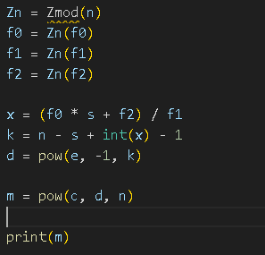

## Conquer

---

## ソースコード

---

## 暗号化部分 ROL

となっており、ROL を 32 回回している

---

## 暗号化部分 ROL

上記が ROL の中身
(bits << 1) & (2\*\*length - 1)が bits を 1 回左シフトして length 分だけ取り出したもの
bits >> (length - 1)が最高位 bit
これら二つを結合したものなので、結果的に Nbit 左に循環するものとなる。

---

## 逆演算 ROR

逆演算として、右に循環させればよい (Rotate Right)

---

## solve

結果的に上記のようなコードになったが、なぜかうまくいかない
逆演算で戻ることは確認済み

---

## solve 2

どうやら、平文と暗号文で長さが違うらしい。
いろいろな平文を入れてみた結果、数個長さが違うことが判明。
手動で length をインクリメントしていくと Flag が出てきた。

b'ctf4b{SemiCIRCLErCanalsHaveBeenConqueredByTheCIRCLE!!!}'

---

## Choice

---

## ソースコード

---

## わかっているもの

- n
- e
- c
- pq+qr+rp
- p^k + q^k + r^k mod n (何度でも入手可能)

---

## 立式

φ(n) = (p-1)(q-1)(r-1) = pqr + (p+q+r) - (pq+qr+rp) - 1  
より今わかっていないのは p+q+r  
これをどうにかして求めたい  
p^k + q^k + r^k mod n が何個でも入手できるので、これを何種類か用いて p+q+r を求める方針  
それぞれの値を a0,a1,a2 と置くと
p+q+r = (a0 \* s + a2) / a1
が成り立つ。(地道に計算しました)

---

## solve

剰余の世界での割り算のやり方が少し微妙だったので SageMath で

結果は 44984631659673579417152334534156063092661367339087415184836276662153074797693

---

## long_to_bytes

結果を print(long_to_bytes)すると Flag を得れた

b'ctf4b{E4sy_s7mmetr1c_polyn0mial}'
